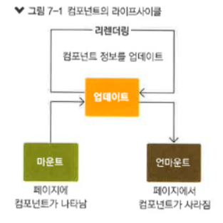
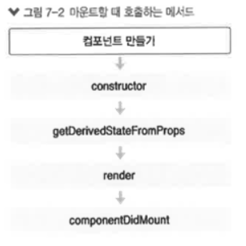
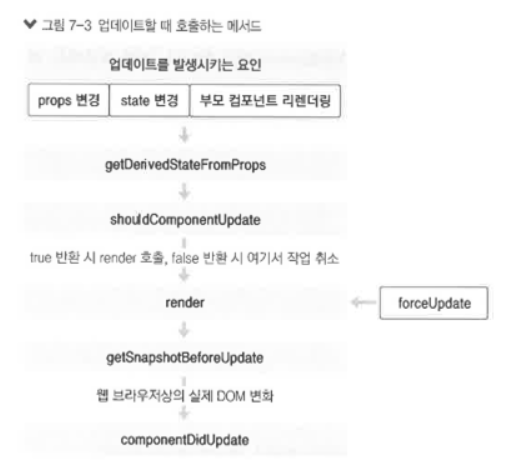
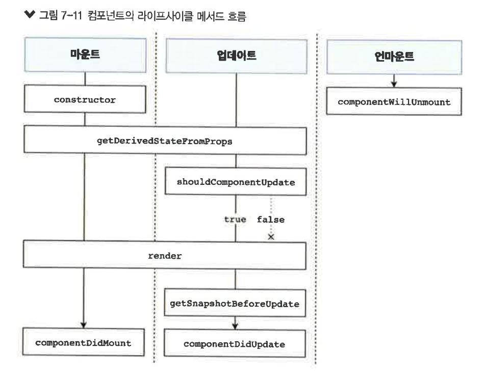

# 컴포넌트의 라이프 사이클 메서드

- 리액트의 컴포넌트는 생명주기(컴포넌트가 생성되고 사용되고 소멸될 때까지의 일련의 과정)를 가진다 -> 생명주기 안에서는 특정 시점에 자동으로 호출되는 메서드가 있는데 이를 **라이프 사이클 메서드**라고 한다
- 리액트 프로젝트 진행 중 컴포넌트를 처음으로 렌더링 할 때 어떤 작업을 처리하거나, 컴포넌트를 업데이트하기 전후로 처리하거나, 불필요한 업테이트를 방지해아할 때 라이프사이클 메서드를 사용
  <br/><br/>

1. 라이프사이클 메서드의 이해

- **Will** 접두사가 붙은 메서드는 어떤 작업을 작동하기 **전**에 실행되는 메서드
- **Did** 접두사가 붙은 메서드는 어떤 작업을 작동한 **후**에 실행되는 메서드

  1. 라이프 사이클<br>

  - 라이프사이클은 마운트,업데이트,언마운트 카테고리로 나뉜다.

    <br/>

    - 마운트

      - DOM이 생성되고 웹 브라우저상에 나타나는 것
        <br/>
        - **constructor** : 컴포넌트를 새로 만들 때마다 호출되는 클래스 생성자 메서드
        - **getDerivedStateFromProps** : props에 있는 값을 state에 넣을 때 사용하는 메서드
        - **render** : 준비한 UI를 렌더링하는 메서드
        - **componentDidMount** : 컴포넌트가 웹 브라우저상에 나타난 후 호출하는 메서드

    - 업데이트

      - props가 바뀔 때
      - state가 바뀔 때
      - 부모 컴포넌트가 리렌더링될 때
      - this.forceUpdate로 강제로 렌더링을 트리거할 때<br/><br/>

        <br/>

      - getDeriveStateFromProps : 마운트 과정에서도 호출, 업데이트가 시작하기 전에도 호출된다. props의 변화에 따라 state 값에도 변화를 주고 싶을 때 사용
      - shouldComponentUpdate : 컴포넌트가 리렌더링을 해야 할지 말아야 할지를 결정하는 메서드(true, false 값을 반환)<br>
        true를 반환하면 다음 라이프사이클 메서드를 계속 실행, false를 반환하면 작업을 중지<br/>
        특정 함수에서 this.forceUpdate() 함수를 호출하면 이 과정을 생략하고 바로 render 함수를 호출
      - render : 컴포넌트를 리렌더링한다
      - getSnapshotBeforeUpdate : 컴포넌트의 업데이트 작업이 끝난 후 호출하는 메서드 
      - componentDidUpdate : 컴포넌트의 업데이트 작업이 끝난 후 호출하는 메서드

    - 언마운트
      - 컴포넌트를 DOM에서 제거하는 것
      - componentWillUnmount : 컴포넌트가 웹 브라우저상에서 사라지기 전에 호출하는 메서드


  2. 라이프사이클 메서드 살펴보기

	- **constructor** 메서드
      **constructor(props){ ... }**
      - 컴포넌트의 생성자 메서드로 컴포넌트를 만들 때 처음으로 실행(초기 state를 설정)
	  
	- **getDerivedStateFromProps** 메서드
      - props로 받아 온 값을 state에 동기화시키는 용도로 사용, 컴포넌트가 마운트 될 때와 업데이트 될 때 호출
      ```js
      static getDerivedStateFromProps(nextProps, prevState){
        if(nextProps.value !== prevState.value){  //조건에 따라 특정 값 동기화
          return { value:nextProps.value};
        }
        return null;  //state를 변경할 필요가 없다면 null 반환
      }
      ```

    - **render**()함수 
      - 컴포넌트 모양새를 정의(라이프 사이클 메서드 중 필수 메서드)
      - this.props와 this.state에 접근 가능/ 리액트 요소(div같은 태그나 컴포넌트)를 반환<br/> 요소는 태그가 될 수도 있고, 컴포넌트가 될 수도 있음

        
    - **componentDidMount** 메서드 
      **componentDidMount(){ ... }**
      - 컴포넌트를 만들고 첫 렌더링을 마친 후 실행
      - 이 안에서 라이브러리 또는 함수를 호출하거나 이벤트 등록, setTimeout, setInterval, 네트워크 요청 같은 비동기 작업을 처리

    - **shouldComponentUpdate** 메서드
      **shouldComponentUpdate(nextProps, nextState){ ... }**
      - props 또는 state를 변경했을 때, 리렌더링을 시작할지 여부를 지정하는 메서드
      - 이 메서드는 반드시 true 값 또는 false 값을 반환해야 함(기본 값은 true)
      - false값을 반환하면 업데이트 과정은 여기서 중지

    - **getSnapshotBeforeUpdate** 메서드
      - render에서 만들어진 결과물이 브라우저에 실제로 반영되기 직전에 호출
      - 이 메서드에서 반환하는 값은 **componentDidUpdate**에 세번째 파라미터인 snapshot 값으로 전달
      - 업데이트하기 직전의 값을 참고할 일이 있을 때 활용

      ```js
      getSnapshotBeforeUpdate(prevProps, prevState){
        if(prevState.array !== this.state.array){
          const {scrollTop, scrollHeight} = this.list
          return {scrollTop, scrollHeight};
        }
      }
      ```

    - **componentDidUpdate** 메서드
      **componentDidUpdate**(prevProps, prevState, snapshot){ ... }
      - 리렌더링을 완료한 후 실행
      - 업데이트가 끝난 직후이므로, DOM 관련 처리를 해도 됨
      - prevProps 또는 prevState를 사용하여 컴포넌트가 이전에 가졌던 데이터에 접근
      - getSnapshotBeforeUpdate 에서 반환한 값이 있다면 여기서 snapshot 값을 전달받을 수 있음

    - **componentWillUnmount** 메서드
      **componentWillUnmount**(){ ... }
      - 컴포넌트를 DOM에서 제거할 때 실행
      - componentDidMount에서 등록한 이벤트, 타이머, 직접 생성한 DOM이 있다면 여기서 제거 작업을 해야 한다

    - **componentDidCatch** 메서드
      - 컴포넌트 렌더링 도중에 에러가 발생했을 때 애플리케이션이 먹통이 되지 않고 오류 UI를 보여 줄 수 있게 해줌
      ```js
      componentDidCatch(error, info){ //error는 파라미터에 어떤 에러가 발생했는지, info는 어디에 있는 코드에서 오류가 발생했는지
        this.setState({
          error:true
        });
        console.log({error, info});
      }
      ```
  3. 예제로 알아보기
     ```js
     App.js

      import React,{Component} from 'react';
      import LifeCycleSample from './LifeCycleSample'

      function getRandomColor() {
        return '#'+ Math.floor(Math.random() * 16777215).toString(16);
      }
      class App extends Component {
        state={
          color: '#000000'
        }
        
        handleClick=()=>{
          this.setState({
            color:getRandomColor()
          })
        }

        render(){
        return (
          <div>
            <button onClick={this.handleClick}>랜덤 색상</button>
          <LifeCycleSample color={this.state.color}/>
            </div>
        );
      };
      }

      export default App;
     ```

    ```js
     LifeCycleSample.js

     import React, { Component } from 'react';

      class LifeCycleSample extends Component {
        state ={
            number:0,
            color:null,
        }
        myRef= null; //ref를 설정할 부분

        constructor(props){
            super(props);
            console.log('constructor');
        }

        static getDerivedStateFromProps(nextProps, prevState){
            console.log('getDerivedStateFromProps');
            if(nextProps.color !== prevState.color){
                return {color:nextProps.color};
            }
            return null;
        }

        componentDidMount(){
            console.log('componentDidMount')
        }

        shouldComponentUpdate(nextProps, nextState){
            console.log('shouldComponentUpdate', nextProps, nextState);

            // 숫자의 마지막 자리가 4면 리렌더링하지 않습니다.
            return nextState.number % 10 !==4;
        }

        componentWillUnmount(){
            console.log('componentWillUnmount');
        }

        handleClick = () =>{
            this.setState({
                number:this.state.number+1
            });
        }

        getSnapshotBeforeUpdate(prevProps, prevState){
            console.log('getSnapshotBeforeUpdate');
            if(prevProps.color !== this.props.color){
                return this.myRef.style.color;
            }
            return null;
        }

        componentDidUpdate(prevProps, prevState, snapshot){
            console.log('componentDidUpdate', prevProps, prevState);
            if(snapshot){
                console.log("업데이트되기 직전 색상:", snapshot);
            }
        }

        render() {
            console.log('render');

            const style ={
                color : this.props.color
            }

            return (
                <div>
                    <h1 style={style} ref={ref=>this.myRef=ref}>
                        {this.state.number}</h1>
                        <p>color:{this.state.color}</p>
                        <button onClick={this.handleClick}>
                            더하기
                        </button>
                </div>
            );
        }
    }

    export default LifeCycleSample;
    ```
  3-1. 에러 잡아내기

    ```js
    import React, { Component } from 'react';

    class LifeCycleSample extends Component {
        state ={
            number:0,
            color:null,
        }
        myRef= null; //ref를 설정할 부분

        constructor(props){
            super(props);
            console.log('constructor');
        }

        static getDerivedStateFromProps(nextProps, prevState){
            console.log('getDerivedStateFromProps');
            if(nextProps.color !== prevState.color){
                return {color:nextProps.color};
            }
            return null;
        }

        componentDidMount(){
            console.log('componentDidMount')
        }

        shouldComponentUpdate(nextProps, nextState){
            console.log('shouldComponentUpdate', nextProps, nextState);

            // 숫자의 마지막 자리가 4면 리렌더링하지 않습니다.
            return nextState.number % 10 !==4;
        }

        componentWillUnmount(){
            console.log('componentWillUnmount');
        }

        handleClick = () =>{
            this.setState({
                number:this.state.number+1
            });
        }

        getSnapshotBeforeUpdate(prevProps, prevState){
            console.log('getSnapshotBeforeUpdate');
            if(prevProps.color !== this.props.color){
                return this.myRef.style.color;
            }
            return null;
        }

        componentDidUpdate(prevProps, prevState, snapshot){
            console.log('componentDidUpdate', prevProps, prevState);
            if(snapshot){
                console.log("업데이트되기 직전 색상:", snapshot);
            }
        }

        render() {
            console.log('render');

            const style ={
                color : this.props.color
            }

            return (
                <div>
                    {this.props.missing.value} // 에러 발생시키기
                    <h1 style={style} ref={ref=>this.myRef=ref}>
                        {this.state.number}</h1>
                        <p>color:{this.state.color}</p>
                        <button onClick={this.handleClick}>
                            더하기
                        </button>
                </div>
            );
        }
    }

    export default LifeCycleSample;
    ```

    ```js
    import React, { Component } from 'react';

    class ErrorBoundary extends Component {
        state = {
            error:false
        }
        componentDidCatch(error, info){
            this.setState({
                error:true
            });
            console.log({error,info});
        }
        render() {
            if(this.state.error) return <div>에러가 발생했습니다</div>
            return this.props.children
        }
    }

    export default ErrorBoundary;
    ```

    ```js
    import React, { Component } from 'react';
    import ErrorBoundary from './ErrorBoundary';
    import LifeCycleSample from './LifeCycleSample'

    function getRandomColor() {
      return '#' + Math.floor(Math.random() * 16777215).toString(16);
    }
    class App extends Component {
      state = {
        color: '#000000'
      }

      handleClick = () => {
        this.setState({
          color: getRandomColor()
        })
      }

      render() {
        return (
          <div>
            <button onClick={this.handleClick}>랜덤 색상</button>
            <ErrorBoundary>
            <LifeCycleSample color={this.state.color} />
            </ErrorBoundary>
          
          </div>
        );
      };
    }

    export default App;
    ```

<br/>